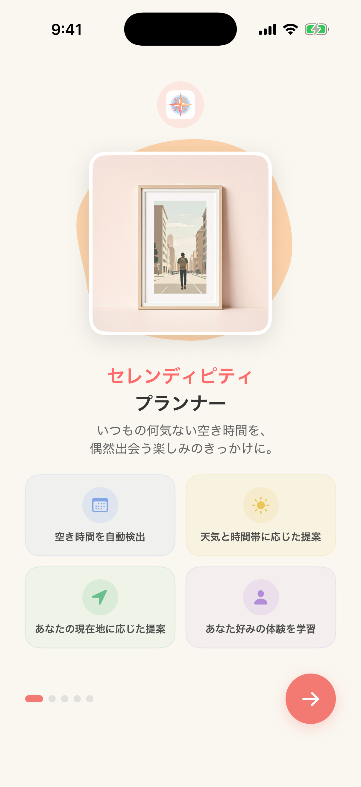

# Serendipity Planner

Appleカレンダーの隙間時間を自動検出し、天気・時間帯・好みに応じた体験を提案するiOSアプリ。

<p align="center">
  
</p>

## 機能

- **隙間時間の自動検出** - EventKitでカレンダーの予定を分析し、空き時間を検出
- **天気連動の提案** - OpenWeatherMap APIで天気を取得し、天気に最適な体験を提案
- **10の体験カテゴリ** - カフェ・散歩・読書・音楽・アート・フィットネス・ショッピング・グルメ・映画・リラックスから重み付きランダムで提案
- **時間帯に応じた空のグラデーション背景** - 朝・昼・夕方・夜で変化し、天気条件も反映
- **近くのスポット提案** - カテゴリに応じた周辺のお店・スポットを提案
- **スマート通知** - 朝の概要通知や空き時間前の体験提案通知
- **学習機能** - 提案の受け入れ履歴からカテゴリの重み付けを学習
- **履歴** - 受け入れた提案を自動保存し、月単位で振り返り・カテゴリ別サマリー表示
- **お気に入り** - 気に入った提案を保存、カテゴリフィルタで一覧表示、お気に入りカテゴリは提案時に優遇
- **ウィジェット対応** - ホーム画面ウィジェットで次の空き時間と提案をクイック表示（Small / Medium）
- **カスタマイズ** - 最小空き時間、平日/休日のアクティブ時間、カテゴリの選択が可能

## 画面構成

| 画面 | 説明 |
|------|------|
| オンボーディング | 初回起動時のウェルカム・権限許可・興味選択（6ステップ） |
| ホーム | 今日の隙間時間と提案一覧、天気バッジ表示 |
| 履歴 | 受け入れた提案の月別振り返り、カテゴリ別サマリー |
| お気に入り | 気に入った提案の保存・カテゴリフィルタ |
| 提案詳細 | 提案の詳細、周辺マップ、受け入れ/別の提案 |
| 設定 | 通知・アクティブ時間・カテゴリ・学習データの管理 |
| ウィジェット | 次の空き時間と提案をホーム画面に表示（Small / Medium） |

## 技術スタック

| 項目 | 技術 |
|------|------|
| UI | SwiftUI |
| アーキテクチャ | MVVM |
| カレンダー | EventKit |
| 天気API | OpenWeatherMap |
| 位置情報 | CoreLocation |
| 非同期処理 | Swift Concurrency (async/await) |
| ウィジェット | WidgetKit |
| データ永続化 | UserDefaults + JSONEncoder/JSONDecoder |
| プロジェクト管理 | XcodeGen |
| 最低対応OS | iOS 15.0 |

## セットアップ

### 前提条件

- Xcode 15.0以上
- XcodeGen (`brew install xcodegen`)

### ビルド手順

```bash
# 1. APIキーの設定（初回のみ）
cp Config/Debug.xcconfig.example Config/Debug.xcconfig
# Config/Debug.xcconfig を開いて、APIキーを設定

# 2. XcodeGenでプロジェクト生成
xcodegen generate

# 3. ビルド
xcodebuild build -project SerendipityPlanner.xcodeproj -scheme SerendipityPlanner -destination 'generic/platform=iOS Simulator'

# 4. テスト実行
xcodebuild test -project SerendipityPlanner.xcodeproj -scheme SerendipityPlanner -destination 'platform=iOS Simulator,name=iPhone 17 Pro'
```

### OpenWeatherMap APIキーの設定

1. [OpenWeatherMap](https://openweathermap.org/api) でAPIキーを取得
2. `Config/Debug.xcconfig.example` を `Config/Debug.xcconfig` にコピー
3. `Config/Debug.xcconfig` の `OPENWEATHERMAP_API_KEY` にキーを設定

> APIキーが未設定の場合、モック天気データ（晴れ・18.5°C）で動作します。
> `Config/Debug.xcconfig` は `.gitignore` で除外されているため、キーがリポジトリに含まれることはありません。

## プロジェクト構成

```
SerendipityPlanner/
├── App/           # エントリーポイント、AppDelegate
├── Models/        # データモデル（FreeTimeSlot, Suggestion, WeatherData等）
├── ViewModels/    # MVVM ViewModel層
├── Views/         # SwiftUI View層
│   ├── Home/          # ホーム画面、SkyGradientView
│   ├── Suggestion/    # 提案詳細・受け入れ画面
│   ├── History/       # 履歴一覧・月別サマリー
│   ├── Favorites/     # お気に入り一覧・詳細
│   ├── Settings/      # 設定・通知設定画面
│   ├── Onboarding/    # オンボーディングフロー（6画面）
│   └── Common/        # 共通コンポーネント
├── Services/      # ビジネスロジック層
├── Utilities/     # 定数、テンプレート、Extension
└── Resources/     # アセット

SerendipityWidget/     # ホーム画面ウィジェット（WidgetKit）
├── Views/             # Small / Medium ウィジェットビュー
└── SharedDataManager  # App Group 経由のデータ共有
```

## 提案アルゴリズム

重み付きランダム選択で、以下の要素を考慮:

1. **天気補正** - 雨天時は屋内カテゴリ↑屋外↓、晴天時は散歩・フィットネス↑
2. **時間帯補正** - 各カテゴリに適した時間帯で重みを増加（例: 朝はカフェ、夜は読書・映画）
3. **時間長補正** - 空き時間の長さに応じてカテゴリを調整
4. **学習補正** - ユーザーの過去の選択履歴に基づいて重みを調整
5. **お気に入りボーナス** - お気に入りに登録されたカテゴリに 1.2 倍の重みボーナスを付与
6. **ユーザー設定** - 好みのカテゴリで絞り込み
