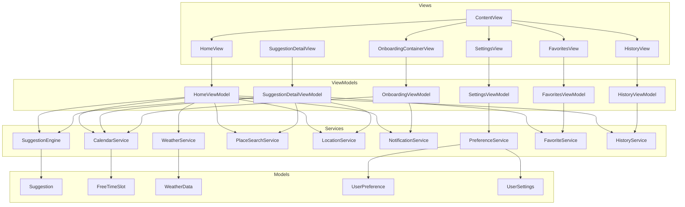
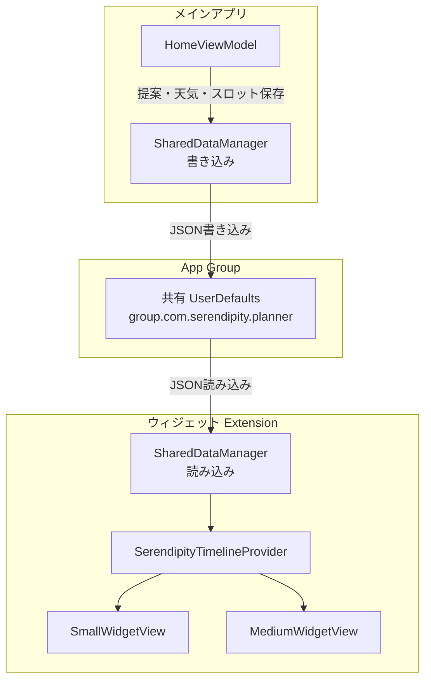

# Serendipity Planner - アーキテクチャ概要

## 全体アーキテクチャ

MVVM（Model-View-ViewModel）パターンを採用し、View / ViewModel / Service の3層で構成されています。



---

## ViewModel 層

4つの ViewModel がそれぞれの画面のビジネスロジックを担当します。

| ViewModel | 責務 |
|-----------|------|
| HomeViewModel | ホーム画面のデータフロー統括。カレンダー取得→天気取得→提案生成→スポット検索の一連のフローを管理。提案受け入れ時に履歴保存 |
| SuggestionDetailViewModel | 提案の受け入れ、代替案の生成、カレンダー登録、スポット検索、お気に入りトグル |
| HistoryViewModel | 履歴一覧の状態管理。月ナビゲーション、日付グルーピング、カテゴリ別集計 |
| FavoritesViewModel | お気に入り一覧の状態管理。カテゴリフィルタ、削除、利用可能カテゴリの集計 |
| SettingsViewModel | ユーザー設定の読み込み・保存。通知、時間帯、カテゴリ、学習データの管理 |
| OnboardingViewModel | 5画面のページ遷移管理。カレンダー・通知・位置情報の権限リクエスト |

すべての ViewModel は `@MainActor` で修飾されており、UI スレッドでの安全な状態更新を保証します。

---

## Service 層

7つのサービスがドメインロジックと外部システム連携を担当します。

| Service | 責務 | 外部依存 |
|---------|------|---------|
| CalendarService | カレンダーイベント取得、隙間時間検出、イベント追加 | EventKit |
| WeatherService | 天気情報の取得、キャッシュ管理 | OpenWeatherMap API |
| SuggestionEngine | 重み計算、カテゴリ選択、テンプレート適用 | なし（純粋ロジック） |
| PlaceSearchService | 近隣スポットの検索 | MapKit (MKLocalSearch) |
| LocationService | 現在地取得、逆ジオコーディング | CoreLocation |
| NotificationService | 通知のスケジュール・キャンセル | UserNotifications |
| PreferenceService | ユーザー設定・好みの永続化、状態公開 | UserDefaults |
| FavoriteService | お気に入り提案の管理・永続化・状態公開 | UserDefaults |
| HistoryService | 提案履歴の永続化・月別フィルタ・カテゴリ別集計 | UserDefaults |
| SharedDataManager | アプリ⇔ウィジェット間のデータ共有 | App Group UserDefaults |

---

## ウィジェットアーキテクチャ

WidgetKit を使用したホーム画面ウィジェットは、メインアプリとは別ターゲット（`SerendipityWidgetExtension`）で動作します。



### 共有データ

| データ | 型 | 用途 |
|--------|---|------|
| FreeTimeSlot | [FreeTimeSlot] | 次の空き時間表示 |
| Suggestion | [Suggestion] | 提案内容の表示 |
| WeatherData | WeatherData? | 天気情報の表示 |

### タイムライン更新

- 15 分間隔で `SerendipityTimelineProvider` がタイムラインを再生成
- 現在時刻以降の次の空きスロットと対応する提案を選択

---

## 依存注入パターン

### ContentView をルートとした注入

`ContentView` がアプリのルートビューとして、サービスのインスタンス化と EnvironmentObject への注入を行います。

```swift
struct ContentView: View {
    @StateObject private var preferenceService = PreferenceService()
    @StateObject private var favoriteService = FavoriteService()

    var body: some View {
        let locationService = LocationService(preferenceService: preferenceService)
        Group {
            if preferenceService.settings.hasCompletedOnboarding {
                MainTabView(locationService: locationService)
            } else {
                OnboardingContainerView { ... }
            }
        }
        .environmentObject(preferenceService)
        .environmentObject(locationService)
        .environmentObject(favoriteService)
    }
}
```

### 注入の流れ

```mermaid
graph LR
    CV[ContentView] -->|@StateObject| PFS[PreferenceService]
    CV -->|init| LS[LocationService]
    CV -->|.environmentObject| E1["@EnvironmentObject<br/>PreferenceService"]
    CV -->|.environmentObject| E2["@EnvironmentObject<br/>LocationService"]

    HV[HomeView] -->|configure| HVM[HomeViewModel]
    HVM -->|内部生成| CS[CalendarService]
    HVM -->|内部生成| WS[WeatherService]
    HVM -->|内部生成| SE[SuggestionEngine]
    HVM -->|内部生成| NS[NotificationService]
    HVM -->|内部生成| PS[PlaceSearchService]
```

- **PreferenceService**、**LocationService**、**FavoriteService** は EnvironmentObject として全画面で共有
- **HomeViewModel** は `configure(with:locationService:)` メソッドで外部サービスを受け取り、内部でその他のサービスを生成
- **SuggestionDetailViewModel** は `configure(weather:preference:...)` で必要なデータとサービスを受け取る

---

## 非同期処理パターン

### async/await

すべての非同期処理は Swift Concurrency（async/await）を使用しています。

```swift
func loadData() async {
    isLoading = true
    let location = await locationService?.requestCurrentLocation()

    async let weatherTask: () = fetchWeather(location: location)
    async let slotsTask: () = fetchFreeTimeSlots()
    _ = await (weatherTask, slotsTask)

    generateSuggestions()
    isLoading = false
}
```

### @MainActor

ViewModel は `@MainActor` で修飾し、`@Published` プロパティの更新がメインスレッドで行われることを保証しています。

### CheckedContinuation

`LocationService` では、CoreLocation のデリゲートベースの API を async/await に橋渡しするために `CheckedContinuation` を使用しています。

```swift
func requestCurrentLocation() async -> CLLocation? {
    return await withCheckedContinuation { continuation in
        self.locationContinuation = continuation
        locationManager.requestLocation()
    }
}
```

### async let による並列実行

`HomeViewModel.loadData()` では天気取得とカレンダー取得を `async let` で並列実行し、パフォーマンスを最適化しています。

---

## エラーハンドリング方針

| レイヤー | 方針 |
|---------|------|
| Service 層 | `throws` でエラーを上位に伝播。独自の `Error` enum を定義 |
| ViewModel 層 | `do-catch` でエラーをキャッチし、`errorMessage: String?` として UI に公開 |
| View 層 | `errorMessage` の有無で ErrorStateView を表示。再読み込みボタンを提供 |
| フォールバック | 天気取得失敗時はモックデータ、位置情報失敗時は天気なしで動作 |

### エラー型一覧

| サービス | エラー型 | ケース |
|---------|---------|-------|
| CalendarService | CalendarError | accessDenied, fetchFailed |
| WeatherService | WeatherError | invalidAPIKey, networkError, decodingError, invalidURL, cityNotFound |
