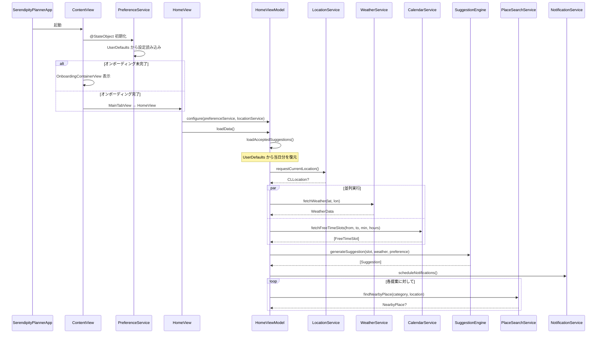
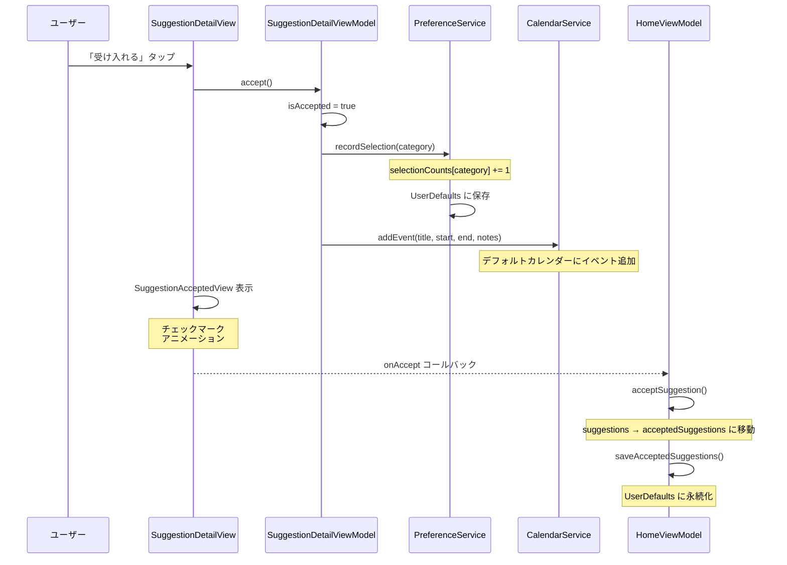
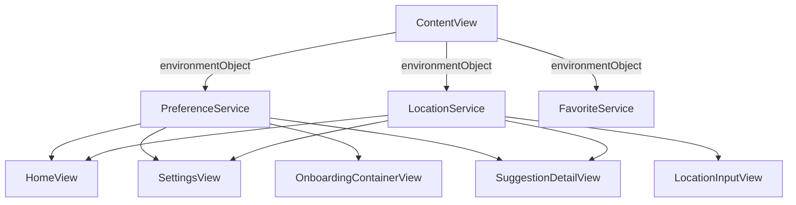

# Serendipity Planner - データフロー

## アプリ起動時のデータフロー



---

## 提案受け入れフロー



---

## データモデル一覧

| モデル | 型 | Codable | 主要プロパティ |
|-------|---|---------|-------------|
| Suggestion | struct | Yes | id, category, title, description, duration, freeTimeSlot, weatherContext, isAccepted, nearbyPlace |
| FreeTimeSlot | struct | Yes | id, startDate, endDate |
| WeatherData | struct | Yes | temperature, condition, description, humidity, windSpeed, fetchedAt |
| UserPreference | struct | Yes | preferredCategories, minimumFreeTimeMinutes, activeHours, selectionCounts |
| UserSettings | struct | Yes | hasCompletedOnboarding, notificationsEnabled, morningNotificationEnabled/Hour, beforeFreeTimeNotificationEnabled, notificationLeadTimeMinutes |
| NearbyPlace | struct | Yes | id, name, category, latitude, longitude, distance |
| FavoriteSuggestion | struct | Yes | id, title, category, description, placeName, latitude, longitude, placeAddress, addedDate |

### 補助型

| 型 | 種類 | 説明 |
|----|------|------|
| SuggestionCategory | enum | 10カテゴリの定義（cafe, walk, reading 等） |
| WeatherCondition | enum | 8天気条件の定義（clear, clouds, rain 等） |
| WeightProfile | struct | カテゴリ別の重み補正パラメータ |
| ActiveHoursConfig | struct | 開始/終了時刻のペア |
| ActiveHoursPreference | struct | 平日/休日の ActiveHoursConfig |

---

## UserDefaults キー一覧

| キー | 定数 | 格納データ | 型 |
|------|------|---------|---|
| `userSettings` | Constants.Storage.userSettingsKey | アプリ設定 | UserSettings (JSON) |
| `userPreference` | Constants.Storage.userPreferenceKey | ユーザー好み | UserPreference (JSON) |
| `weatherCache` | Constants.Storage.weatherCacheKey | 天気キャッシュ | WeatherData (JSON) |
| `acceptedSuggestions` | Constants.Storage.acceptedSuggestionsKey | 受け入れ済み提案 | [Suggestion] (JSON) |
| `favoriteSuggestions` | Constants.Storage.favoriteSuggestionsKey | お気に入り提案 | [FavoriteSuggestion] (JSON) |

天気キャッシュは座標ごとに別キーで保存されます（例: `weather_cache_coord_35.68_139.77`）。

---

## 状態管理パターン

### @Published（ViewModel → View）

ViewModel の `@Published` プロパティが変更されると、SwiftUI が自動的にビューを再描画します。

```
HomeViewModel
├── @Published freeTimeSlots: [FreeTimeSlot]
├── @Published suggestions: [Suggestion]
├── @Published acceptedSuggestions: [Suggestion]
├── @Published weather: WeatherData?
├── @Published isLoading: Bool
└── @Published errorMessage: String?
```

### @EnvironmentObject（グローバル状態の共有）

`PreferenceService` と `LocationService` は `@EnvironmentObject` としてビュー階層全体で共有されます。



### @StateObject と @ObservedObject

| アノテーション | 使用場面 |
|-------------|---------|
| @StateObject | ViewModel の所有者（ビューが作成するインスタンス） |
| @ObservedObject | ViewModel の参照者（親ビューから渡されるインスタンス） |

---

## データクリーンアップ

### 天気キャッシュ

- 有効期限: 1 時間（`cacheExpirationSeconds = 3600`）
- `WeatherData.isExpired` で判定
- 期限切れの場合は API を再呼び出し

### 受け入れ済み提案

- アプリ起動時に `loadAcceptedSuggestions()` で当日分のみ復元
- 昨日以前のデータは自動削除
- 全件が古い場合は UserDefaults からキーごと削除
