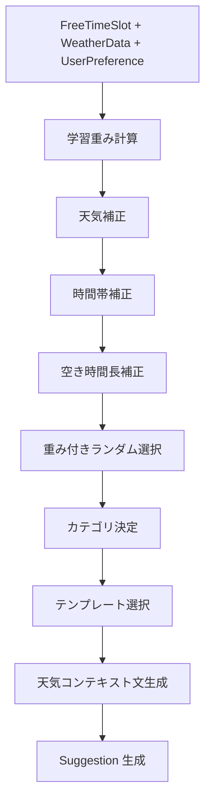

# Serendipity Planner - 提案アルゴリズム

## アルゴリズム全体フロー



---

## Step 1: 学習重み計算

ユーザーの選択履歴に基づいて、各カテゴリの初期重みを決定します。

### 選択履歴なしの場合

全カテゴリに均等な重み:

```
weight = 1.0 / カテゴリ数
```

例: 10 カテゴリの場合、各 0.1

### 選択履歴ありの場合

1. **最小保証重みの計算:**
   ```
   minimumWeight = max(0.05, 1.0 / (カテゴリ数 × 3.0))
   ```
   - 10 カテゴリの場合: `max(0.05, 1.0/30.0)` = `0.05`（5%）
   - 5 カテゴリの場合: `max(0.05, 1.0/15.0)` = `0.067`（6.7%）

2. **予約領域の計算:**
   ```
   reservedTotal = minimumWeight × カテゴリ数
   distributable = 1.0 - reservedTotal
   ```
   - 10 カテゴリの場合: 予約 0.50、分配可能 0.50

3. **各カテゴリの重み:**
   ```
   weight[category] = minimumWeight + distributable × (選択回数 / 総選択回数)
   ```

### 計算例

10 カテゴリ、総選択回数 20 回、カフェ 10 回選択の場合:

```
minimumWeight = 0.05
reservedTotal = 0.50
distributable = 0.50

カフェの重み = 0.05 + 0.50 × (10/20) = 0.05 + 0.25 = 0.30 (30%)
未選択カテゴリ = 0.05 + 0.50 × (0/20) = 0.05 (5%)
```

---

## Step 2: 天気補正

天気データに基づいて各カテゴリの重みを調整します。

### アウトドア適性による補正

| 天気条件 | isOutdoorFriendly | 適用される乗数 |
|---------|-------------------|-------------|
| clear, clouds, unknown | true | `outdoorFriendlyMultiplier` |
| rain, drizzle, thunderstorm, snow, mist | false | `outdoorUnfriendlyMultiplier` |

### 気温による補正

| 気温範囲 | 適用される乗数 |
|---------|-------------|
| 15°C 〜 25°C | `comfortableTempMultiplier` |
| 10°C 未満 or 30°C 超 | `coldOrHotMultiplier` |
| 10°C 〜 14°C or 26°C 〜 30°C | 補正なし（×1.0） |

### 補正例（雨の日）

| カテゴリ | 学習重み | × outdoor補正 | 結果 |
|---------|---------|-------------|------|
| cafe | 0.10 | × 1.5（屋内で上昇） | 0.15 |
| walk | 0.10 | × 0.3（屋外で大幅減） | 0.03 |
| reading | 0.10 | × 1.3（屋内で上昇） | 0.13 |
| movie | 0.10 | × 1.5（屋内で上昇） | 0.15 |

---

## Step 3: 時間帯補正

時間帯に基づいて各カテゴリの重みをさらに調整します。

### 推奨時間帯

推奨時間帯にスロットが該当する場合、`preferredHourMultiplier` を適用します。

### ペナルティ時間帯

ペナルティ時間帯にスロットが該当する場合、`penaltyHourMultiplier` を適用します。

### 例: 12:00 の隙間時間

| カテゴリ | 推奨時間帯 | ペナルティ時間帯 | 補正 |
|---------|-----------|-------------|------|
| cafe | 9-11, 14-16 | なし | ×1.0（範囲外） |
| gourmet | 11-13, 17-20 | 6-9 | ×1.4（推奨時間帯） |
| walk | 8-10, 16-18 | 20-23 | ×1.0（範囲外） |
| art | 10-16 | 20-23 | ×1.3（推奨時間帯） |

---

## Step 4: 空き時間長補正

30 分未満のショートスロットの場合、`shortSlotMultiplier` を適用します。

| カテゴリ | shortSlotMultiplier | 効果 |
|---------|-------------------|------|
| reading | 1.2 | 短時間でも読書は推奨 |
| meditation | 0.8 | やや減少するが許容 |
| cafe | 0.7 | やや減少 |
| walk | 0.5 | 短時間の散歩は非推奨 |
| movie | 0.3 | 短時間で映画は困難 |
| art | 0.5 | 短時間でのアート鑑賞は非推奨 |

---

## Step 5: 重み付きランダム選択

すべての補正が適用された最終重みから、累積重み方式でカテゴリを選択します。

### アルゴリズム

```
1. totalWeight = 全カテゴリの重みの合計
2. random = 0 以上 totalWeight 未満のランダム値を生成
3. cumulative = 0
4. 各カテゴリについて:
   a. cumulative += そのカテゴリの重み
   b. random < cumulative なら、そのカテゴリを返す
5. フォールバック: 最後のカテゴリを返す
```

### エッジケース

- 重みリストが空の場合: `cafe` を返す
- 全重みが 0 の場合: 先頭のカテゴリを返す

---

## 10 カテゴリの WeightProfile 一覧

| カテゴリ | 屋外 | 屋内 | outdoor<br/>Friendly | outdoor<br/>Unfriendly | cold/<br/>Hot | comfortable<br/>Temp | preferred<br/>Hours | penalty<br/>Hours | preferred<br/>Mult | penalty<br/>Mult | short<br/>Slot |
|---------|------|------|-----|-----|-----|-----|-----|-----|-----|-----|-----|
| cafe | - | Y | 1.0 | 1.5 | 1.3 | 1.0 | 9-11, 14-16 | - | 1.3 | 1.0 | 0.7 |
| walk | Y | - | 1.5 | 0.3 | 1.0 | 1.3 | 8-10, 16-18 | 20-23 | 1.3 | 0.5 | 0.5 |
| reading | - | Y | 1.0 | 1.3 | 1.0 | 1.0 | 19-23 | - | 1.3 | 1.0 | 1.2 |
| music | - | Y | 1.0 | 1.3 | 1.0 | 1.0 | 14-17, 19-22 | - | 1.3 | 1.0 | 0.6 |
| art | - | Y | 1.0 | 1.4 | 1.0 | 1.0 | 10-16 | 20-23 | 1.3 | 0.6 | 0.5 |
| fitness | Y | Y | 1.3 | 0.8 | 0.8 | 1.3 | 7-10, 16-19 | 22-23 | 1.3 | 0.5 | 0.7 |
| shopping | - | Y | 1.1 | 1.3 | 1.0 | 1.0 | 11-18 | 21-23 | 1.2 | 0.5 | 0.6 |
| gourmet | - | Y | 1.0 | 1.3 | 1.0 | 1.0 | 11-13, 17-20 | 6-9 | 1.4 | 0.5 | 0.6 |
| movie | - | Y | 1.0 | 1.5 | 1.2 | 1.0 | 13-16, 18-21 | - | 1.3 | 1.0 | 0.3 |
| meditation | Y | Y | 1.3 | 1.0 | 1.0 | 1.2 | 7-10, 17-20 | - | 1.3 | 1.0 | 0.8 |

---

## テンプレート選択

カテゴリが決定した後、そのカテゴリに紐づくテンプレート群から適切なものを選択します。

### 選択ロジック

```
1. カテゴリのテンプレート一覧を取得
2. minDuration <= 空き時間分数 のテンプレートをフィルタ
3. フィルタ結果からランダムに 1 件選択
4. 該当なし → 先頭のテンプレートを使用
```

### 提案の duration

```
duration = min(テンプレートの minDuration, スロットの durationMinutes)
```

---

## 天気コンテキスト文生成

カテゴリと天気データから、ユーザーに表示するコンテキスト文を生成します。

### 生成ロジック

1. 天気データがない場合: 「天気情報を取得できませんでした」
2. 天気サマリーを生成: `"{条件名}で{温度}°C"`
3. 天気がアウトドア向きの場合: `outdoor` フォーマットを使用
4. 天気がアウトドア不向きの場合: `indoor` フォーマットを使用

### フォーマット例（散歩カテゴリ）

- outdoor: `"晴れで22°C。お散歩日和です！"`
- indoor: `"雨ですが、少しの時間なら大丈夫。"`
- neutral: `"曇りで18°C。気分転換に歩いてみましょう。"`

---

## 代替案生成

ユーザーが「別の提案」を要求した場合、現在のカテゴリを除外した提案リストを生成します。

### ロジック

1. `preferredCategories` から除外カテゴリを除く
2. 各カテゴリについて:
   - `minDuration <= スロット時間` のテンプレートをフィルタ
   - ランダムに 1 件選択
3. 天気コンテキスト文を生成
4. 全カテゴリ分の代替案リストを返却

提案詳細画面では、このリストから最大 3 件が表示されます。
