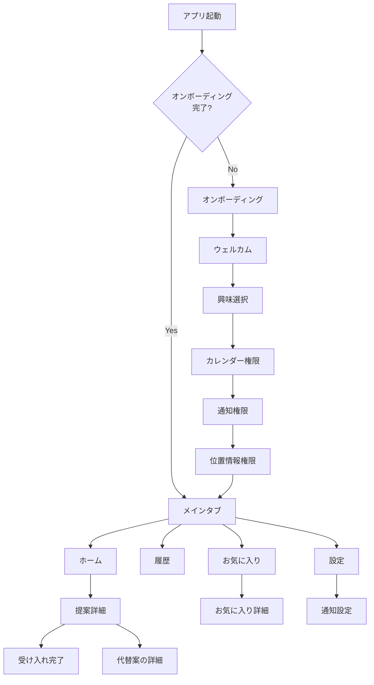

# Serendipity Planner - 画面仕様

## 画面遷移図

---

## ホーム画面（HomeView）

### 構成

| 領域 | コンポーネント | 説明 |
|------|-------------|------|
| 背景 | SkyGradientView | 時間帯×天気条件に基づく空グラデーション |
| ヘッダー | 挨拶テキスト + WeatherBadgeView | 時間帯別の挨拶と天気バッジ |
| 受け入れ済み | AcceptedCardView リスト | 「今日の予定」セクション |
| 提案リスト | FreeTimeCardView リスト | 各隙間時間スロットの提案カード |

### 時間帯別挨拶

| 時間帯 | 挨拶テキスト |
|--------|-----------|
| 5:00 - 9:59 | おはようございます |
| 10:00 - 16:59 | こんにちは |
| 17:00 - 20:59 | こんばんは |
| 21:00 - 4:59 | おつかれさまです |

### 状態表示

- **ローディング中**: 「今日の空き時間を探しています...」（ProgressView）
- **エラー時**: エラーメッセージ + 「再読み込み」ボタン
- **空き時間なし**: 「今日はゆっくりお過ごしください」（空状態ビュー）
- **Pull to refresh**: スワイプで再読み込み

### SkyGradientView

時間帯と天気条件の組み合わせで動的にグラデーションが変化する背景ビューです。

**6 つの時間帯:**

| 時間帯 | 時間範囲 | 基調色 |
|--------|---------|-------|
| dawn（夜明け） | 5:00 - 6:59 | ピンク〜オレンジ |
| morning（朝） | 7:00 - 9:59 | 水色〜クリーム |
| daytime（昼） | 10:00 - 15:59 | 青空〜白 |
| goldenHour（夕焼け） | 16:00 - 17:59 | オレンジ〜ゴールド |
| evening（夕方） | 18:00 - 20:59 | 紫〜ピンク |
| night（夜） | 21:00 - 4:59 | ダークブルー〜藍色 |

**天気条件による調整:**

| 天気条件 | 調整 |
|---------|------|
| clear / unknown | 基本色のまま |
| clouds | グレー方向にブレンド（30%） |
| rain / drizzle | ブルーグレー方向にブレンド（35%）+ 暗く（15%） |
| thunderstorm | パープルグレー方向にブレンド（40%）+ 暗く（30%） |
| snow | 白青方向にブレンド（40%）+ 明るく（15%） |
| mist | 白方向にブレンド（50%） |

**天体装飾:**
- 昼間（dawn〜goldenHour）: 太陽（暖色系のラジアルグラデーション）
- 夜間（evening〜night）: 月（寒色系のラジアルグラデーション）

### WeatherBadgeView

- `.ultraThinMaterial` 背景のコンパクトなバッジ
- 天気アイコン + 気温を表示
- アイコンの色は天気条件に応じて変化（晴れ: ゴールド、雨: ブルー 等）

### FreeTimeCardView

- 時間範囲ヘッダー（例: 「13:00 - 15:00」）+ 所要時間バッジ（例: 「120分」）
- カテゴリアイコン（カテゴリカラーの円形背景）
- 提案タイトルと詳細情報（スポット名 or 天気コンテキスト）
- 受け入れ済みの場合はチェックマーク、未受け入れの場合はシェブロン

### AcceptedCardView

- 受け入れ済み提案のコンパクト表示
- カテゴリアイコンバッジ + タイトル + 時間範囲 + スポット情報
- グリーンのチェックマークインジケーター

---

## 提案詳細画面（SuggestionDetailView）

### 構成

| セクション | 内容 |
|-----------|------|
| ヘッダー | カテゴリアイコン + タイトル + 時間帯/所要時間 |
| 説明 | 提案の詳細テキスト |
| スポット情報 | スポット名・距離・徒歩時間・地図ボタン（スポットがある場合） |
| 地図 | MapKit による周辺地図とカスタムピン（スポットがある場合） |
| 天気コンテキスト | 天気状況とアドバイステキスト |
| アクションボタン | 「受け入れる」/「別の提案を見る」 |
| 受け入れ完了 | チェックマークアニメーション |
| 代替案 | 他カテゴリの提案リスト（最大 3 件） |

### 地図表示

- MapKit の `Map` ビューにカスタムアノテーション
- カテゴリアイコン + 三角ポインター付きのカスタムピン
- ピンの色はカテゴリカラーに連動

### 受け入れアニメーション（SuggestionAcceptedView）

- スプリングアニメーションでチェックマークがスケールイン（0.5 → 1.0）
- 「提案を受け入れました！」テキスト
- 「素敵な体験をお楽しみください」サブテキスト
- 段階的なフェードインアニメーション

### 代替案

- 現在のカテゴリを除外した他カテゴリの提案を最大 3 件表示
- 各代替案をタップすると詳細画面に遷移

---

## 履歴画面（HistoryView）

### 構成

| 領域 | コンポーネント | 説明 |
|------|-------------|------|
| 背景 | SkyGradientView | 時間帯に基づく空グラデーション |
| ヘッダー | タイトル + 月ナビゲーター | 「履歴」テキスト + 月切り替え（時間帯に応じて白/黒切り替え） |
| サマリー | HistorySummaryView | 当月のカテゴリ別回数サマリー |
| リスト | HistoryRowView リスト | 日付ごとにグループ化された履歴カード |

### 月ナビゲーター

- ＜ ＞ ボタンで前月/次月に切り替え
- 当月の場合は＞ボタンが無効化
- 「2026年2月」形式で表示

### HistorySummaryView

- 「今月のまとめ」ヘッダー + 合計回数
- カテゴリアイコン + カテゴリ名 + 回数を 3 列グリッドで表示
- カード背景で可読性を確保

### HistoryRowView

- カテゴリアイコン（白文字・カラー円形背景）
- 提案タイトル、受け入れ時刻、場所名
- カテゴリバッジ（カラー背景付き）
- カード背景 + シャドウ

### 状態表示

- **履歴なし**: 「履歴がありません」（時計アイコン + 説明テキスト）

---

## お気に入り画面（FavoritesView）

### 構成

| 領域 | コンポーネント | 説明 |
|------|-------------|------|
| 背景 | SkyGradientView | 時間帯に基づく空グラデーション |
| ヘッダー | タイトル | 「お気に入り」テキスト（時間帯に応じて白/黒切り替え） |
| フィルタ | カテゴリチップ | 横スクロール可能なカテゴリフィルタバー |
| リスト | FavoriteRowView リスト | カード形式のお気に入り一覧 |

### カテゴリフィルタ

- 「すべて」+ 登録済みカテゴリのチップを横スクロールで表示
- 選択中のチップはカテゴリカラーでハイライト
- タップでフィルタ切り替え

### FavoriteRowView

- カテゴリアイコン（カラー背景付き）
- タイトル、カテゴリ名、場所名、追加日
- カード背景 + シャドウで可読性を確保
- タップでお気に入り詳細画面へ遷移

### 状態表示

- **お気に入りなし**: 「お気に入りはまだありません」（ハートアイコン + 説明テキスト）
- **フィルタ適用時の空状態**: 「このカテゴリのお気に入りはありません」

---

## お気に入り詳細画面（FavoriteDetailView）

### 構成

| セクション | 内容 |
|-----------|------|
| ヘッダー | カテゴリアイコン + タイトル + カテゴリバッジ |
| 説明 | 提案の詳細テキスト |
| スポット情報 | スポット名・住所・地図ボタン（スポットがある場合） |
| 地図 | MapKit による周辺地図とカスタムピン（座標がある場合） |
| 追加日 | お気に入り登録日の表示 |
| 削除ボタン | 確認ダイアログ付きの削除ボタン |

---

## 設定画面（SettingsView）

### セクション構成

| セクション | 設定項目 |
|-----------|---------|
| 場所 | 現在の位置情報（市区町村名） |
| 通知 | 通知設定画面へのリンク |
| 時間設定 | 最小空き時間（30 / 45 / 60 / 90 / 120 分） |
| 平日のアクティブ時間 | 開始時刻 / 終了時刻 |
| 休日のアクティブ時間 | 開始時刻 / 終了時刻 |
| カテゴリ | 10 カテゴリの有効/無効トグル |
| 学習データ | カテゴリ別選択回数 + リセットボタン |
| アプリ情報 | バージョン番号 |

### 通知設定画面（NotificationSettingsView）

| セクション | 設定項目 |
|-----------|---------|
| 通知 | 通知の有効/無効トグル |
| 朝の通知 | 有効/無効 + 通知時刻（6:00〜10:00） |
| 隙間時間前の通知 | 有効/無効 + リードタイム（5 / 10 / 15 / 30 / 60 分） |

### カテゴリ選択

- 最低 1 つのカテゴリが必要（最後の 1 つは解除不可）
- チェックマーク付きリスト表示
- 各カテゴリにアイコンとカラーを表示

---

## オンボーディング（OnboardingContainerView）

### 全体構造

- `TabView` + `.tabViewStyle(.page)` によるページスワイプ
- 下部にページインジケータードット（5 ページ）
- 下部ボタン: 「次へ」（1〜4 ページ目）/ 「はじめる」（5 ページ目）

### 各ページ

#### 1. ウェルカム（WelcomePageView）

- sparkles アイコン
- 「セレンディピティ プランナー」タイトル
- アプリの説明テキスト
- 3 つの機能紹介行（カレンダー検出・天気連動・パーソナライズ）

#### 2. 興味選択（InterestSelectionView）

- heart アイコン
- 「興味のあるジャンルを選んでください」
- 「3つ以上選択してください（後から変更できます）」
- 2 列グリッドでカテゴリをトグル表示
- デフォルト選択: カフェ、散歩、読書
- 3 つ以上選択するまで次へ進めない

#### 3. カレンダー権限（CalendarPermissionView）

- calendar アイコン
- EventKit アクセスの説明
- 「カレンダーへのアクセスを許可」ボタン / 「許可済み」表示

#### 4. 通知権限（NotificationPermissionView）

- bell アイコン
- 通知の説明
- 「通知を許可」ボタン / 「許可済み」表示

#### 5. 位置情報（LocationInputView）

- location アイコン
- 位置情報の説明
- 「位置情報を許可」ボタン / 許可済み（現在地表示）
- 「位置情報はスポット提案と天気取得にのみ使用されます」

---

## テーマ・カラーシステム

### ThemeColors（Color+Theme.swift）

カテゴリごとに固有のカラーが Asset Catalog で定義されています。

| カテゴリ | Asset 名 |
|---------|---------|
| cafe | cafeColor |
| walk | walkColor |
| reading | readingColor |
| music | musicColor |
| art | artColor |
| fitness | fitnessColor |
| shopping | shoppingColor |
| gourmet | gourmetColor |
| movie | movieColor |
| meditation | meditationColor |

### テキストカラー判定

時間帯と天気条件に基づき、SkyGradientView を背景に使う画面（ホーム・履歴・お気に入り）のテキストカラーを明色/暗色で切り替えます。

- **明色テキスト**: evening / night 時間帯（`TimePeriod.prefersLightText`）
- **暗色テキスト**: それ以外の時間帯
- 各画面の `useLightText` 計算プロパティで一元管理
